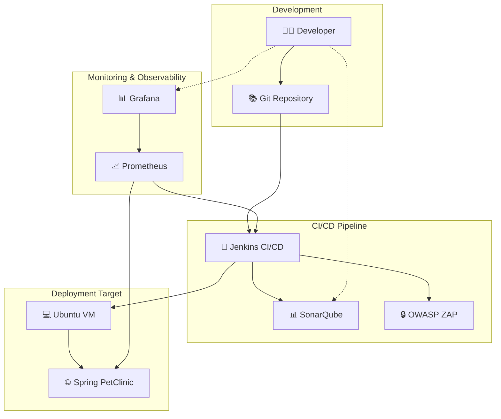
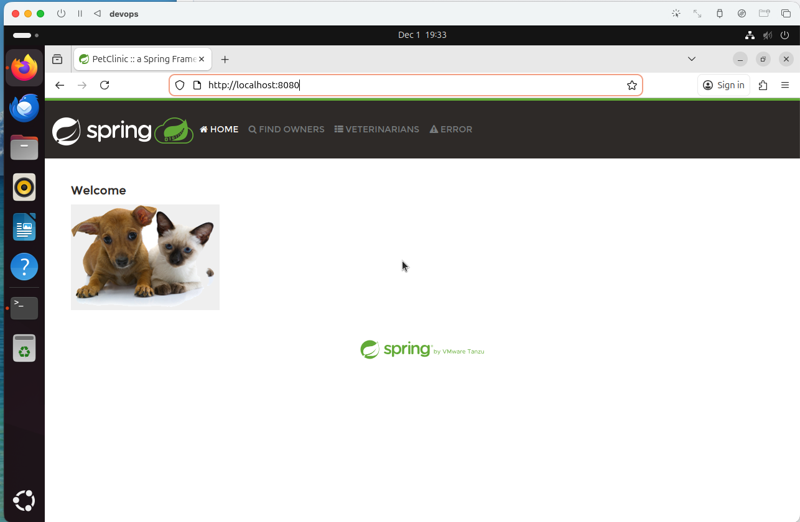

# DevOps Pipeline Documentation

This repository contains comprehensive documentation for setting up a complete DevOps pipeline for the Spring PetClinic application. The pipeline includes continuous integration, code quality analysis, security scanning, monitoring, and automated deployment using modern DevOps tools and practices.

## 🚀 Overview

This DevOps implementation transforms the traditional Spring PetClinic application into a modern, production-ready system with automated build, test, quality assurance, security scanning, monitoring, and deployment processes.

### Architecture Overview

### 🛠️ Technology Stack

| Category | Technology | Purpose |
|----------|------------|---------|
| **CI/CD** | Jenkins | Continuous Integration and Deployment |
| **Code Quality** | SonarQube | Static Code Analysis & Quality Gates |
| **Security** | OWASP ZAP | Dynamic Application Security Testing |
| **Monitoring** | Prometheus | Metrics Collection |
| **Visualization** | Grafana | Monitoring Dashboards |
| **Automation** | Ansible | Configuration Management & Deployment |
| **Containerization** | Docker | Application Containerization |
| **Virtualization** | UTM (macOS) | VM Management |

---

## 📖 Setup Guides

Follow these comprehensive guides to set up your complete DevOps pipeline:

### 0. Major DevOps Components
The major components related to the devops pipeline are under these directories:
- [doc/](doc/) (Here's where the docs are)
- [jenkins/](jenkins/) (Here's where the configuration scripts are)
- [automated_script/](automated_script/) (We have some helper scripts here) 
- [ansible.cfg](ansible.cfg) (Ansible configuration file)
- [Jenkinsfile](Jenkinsfile) (Jenkins pipeline as code file)
- [simple-deploy.yml](simple-deploy.yml) (Ansible playbook for deployment)

Link to the presentation video
- [Click me!](https://youtu.be/KKK7xX2GF5Y)

### 1. 🔧 Jenkins CI/CD Server

**[📄 Jenkins Setup Guide](doc/setup_jenkins.md)**

Set up Jenkins for continuous integration and deployment, including:

- Docker Compose installation and configuration
- Initial Jenkins setup and user creation
- Plugin installation and configuration
- Pipeline creation and management
- Spring PetClinic project integration

**Key Topics:**

- Jenkins Docker deployment
- Security configuration
- Pipeline as Code (Jenkinsfile)
- Multi-branch pipeline setup
- Build artifact management

---

### 2. 📊 Code Quality Analysis

**[📄 SonarQube Setup Guide](doc/setup_sonarqube.md)**

Implement automated code quality analysis and quality gates:

- SonarQube and PostgreSQL setup via Docker Compose
- Project configuration and token generation
- Quality gate configuration
- Jenkins integration with webhooks
- Code coverage and metrics reporting

**Key Topics:**

- Static code analysis
- Technical debt tracking
- Security vulnerability detection
- Code coverage reporting
- Quality gate automation

---

### 3. 📈 Monitoring & Observability

**[📄 Prometheus & Grafana Setup Guide](doc/setup_prometheus_grafana.md)**

Set up comprehensive monitoring and visualization:

- Prometheus metrics collection
- Grafana dashboard configuration
- Jenkins metrics integration
- Alert configuration and notification
- Performance monitoring

**Key Topics:**

- Time-series metrics collection
- Custom dashboard creation
- Alert rule configuration
- Jenkins performance monitoring
- Infrastructure health monitoring

---

### 4. 🤖 Automated Deployment

**[📄 Ansible VM Setup Guide](doc/setup_vm_ansible.md)**

Configure automated deployment using Ansible:

- Ubuntu VM setup with UTM hypervisor
- SSH key configuration and security
- Java environment preparation
- Ansible playbook development
- Jenkins integration and deployment automation

**Key Topics:**

- Virtual machine configuration
- SSH security and key management
- Infrastructure as Code principles
- Automated deployment strategies
- Health check and rollback procedures

---

### 5. 🔒 Security Testing (Coming Soon)

**[📄 OWASP ZAP Setup Guide](doc/setup_zap.md)**

Implement automated security testing:

- Dynamic Application Security Testing (DAST)
- Vulnerability scanning and reporting
- Security gate integration
- Compliance reporting

**Key Topics:**

- Web application security testing
- Vulnerability assessment
- Security reporting and metrics
- Compliance and audit trails

---

## 🚀 Quick Start

To get started with the complete DevOps pipeline:

### Prerequisites

- **macOS** with UTM hypervisor
- **Docker** and Docker Compose
- **Git** command line tools
- **8GB+ RAM** recommended
- **20GB+ free disk space**

### Installation Order

1. **Start with Jenkins** - [Jenkins Setup Guide](doc/setup_jenkins.md)
2. **Add Code Quality** - [SonarQube Setup Guide](doc/setup_sonarqube.md)  
3. **Enable Monitoring** - [Prometheus & Grafana Setup Guide](doc/setup_prometheus_grafana.md)
4. **Configure Deployment** - [Ansible VM Setup Guide](doc/setup_vm_ansible.md)
5. **Add Security Testing** - [OWASP ZAP Setup Guide](doc/setup_zap.md)
### Verification Steps

After completing all setups, verify your pipeline:

1. **🔧 Jenkins**: Access at `http://localhost:8080`
2. **📊 SonarQube**: Access at `http://localhost:9000`
3. **📈 Prometheus**: Access at `http://localhost:9090`
4. **📊 Grafana**: Access at `http://localhost:3000`
5. **🌐 Application**: Access at VM IP on port 8080 

---
