# Jenkins Setup Guide

This guide provides step-by-step instructions for setting up Jenkins for the first time, including initial configuration and creating your first pipeline.

## Prerequisites

- Docker and Docker Compose installed on your system

## Table of Contents

1. [Overview](#overview)
2. [Starting Jenkins with Docker Compose](#starting-jenkins-with-docker-compose)
3. [Initial Jenkins Setup](#initial-jenkins-setup)
4. [Plugin Installation](#plugin-installation)
5. [Creating Admin User](#creating-admin-user)
6. [Jenkins URL Configuration](#jenkins-url-configuration)
7. [Setup Completion](#setup-completion)
8. [Creating Your First Pipeline](#creating-your-first-pipeline)

---

## Overview

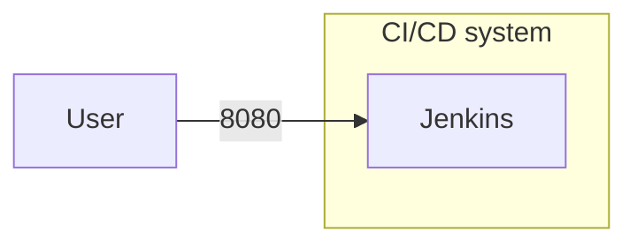
```mermaid
flowchart LR
    user["User"]

    subgraph "CI/CD system"
        jenkins["Jenkins"]
    end

    user --"8080"--> jenkins
```

## Starting Jenkins with Docker Compose

1. Navigate to the Jenkins directory in your project:

   ```bash
   cd jenkins/
   ```

2. Start Jenkins using Docker Compose:

   ```bash
   docker compose up
   ```

   ```bash
    services:
      jenkins:
        image: jenkins/jenkins:2.533-jdk21
        container_name: jenkins
        restart: unless-stopped
        networks:
        - devops
        environment:
        - DOCKER_HOST=tcp://docker:2376
        - DOCKER_CERT_PATH=/certs/client
        - DOCKER_TLS_VERIFY=1
        volumes:
        - ./docker/jenkins/jenkins-data:/var/jenkins_home
        - ./docker/jenkins/jenkins-docker-certs:/certs/client:ro
        ports:
        - "8080:8080"
        - "50000:50000"
   ```

3. Access Jenkins in your web browser:

   ```url
   http://localhost:8080
   ```

---

## Initial Jenkins Setup

### Step 1: Unlock Jenkins

When you first access Jenkins, you'll see the "Unlock Jenkins" screen.

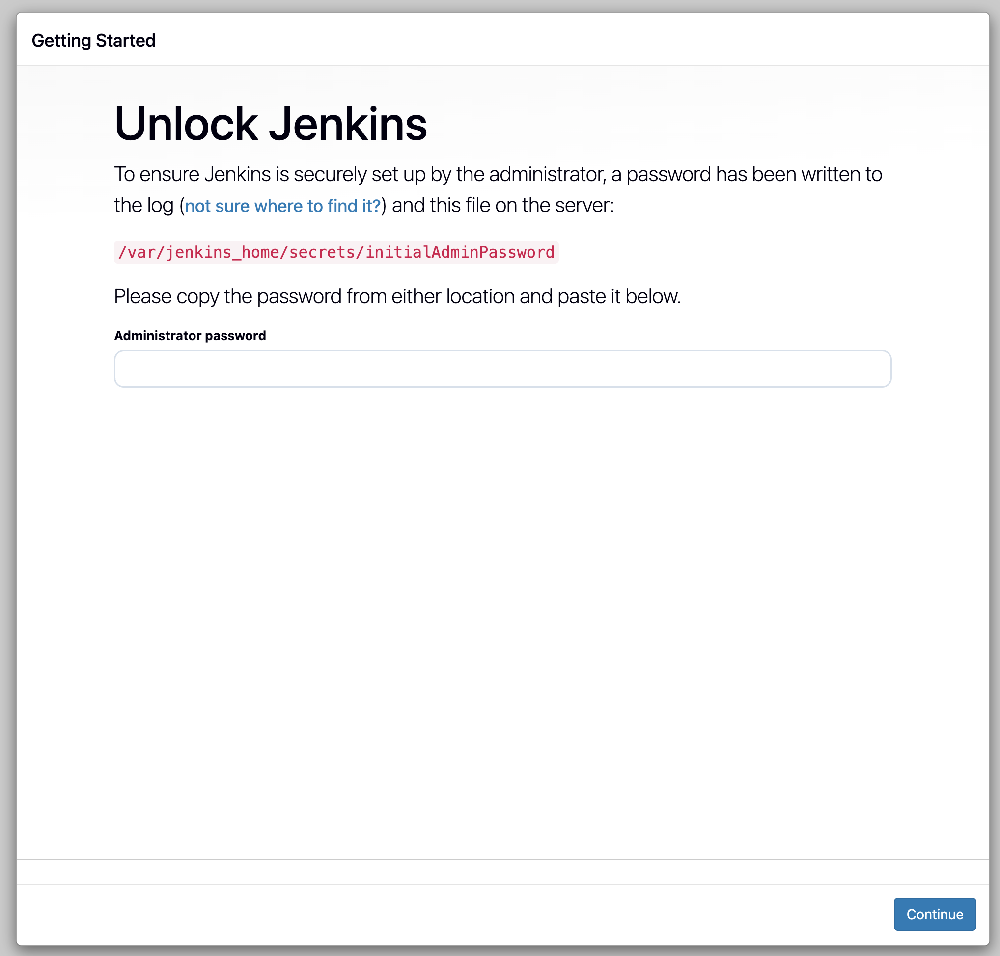

1. **Locate the Initial Admin Password**
   - The password is stored in a file within the Jenkins container
   - You can retrieve it using one of these methods:

   **Method 1: Using Docker logs**

   ```bash
   docker compose logs jenkins
   ```

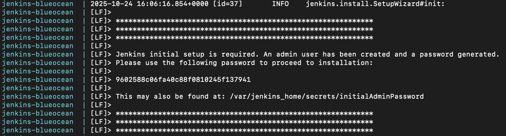

1. **Enter the Password**
   - Copy the password from the terminal
   - Paste it into the "Administrator password" field
   - Click "Continue"

---

## Plugin Installation

### Step 2: Install Plugins

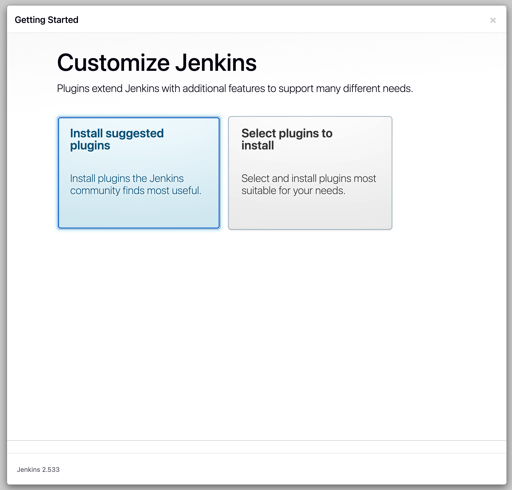

You'll be presented with two options:

1. **Install suggested plugins** (Recommended for beginners)
   - This installs a curated set of commonly used plugins
   - Good for getting started quickly

2. **Select plugins to install** (For advanced users)
   - Allows you to choose specific plugins
   - Requires knowledge of which plugins you need

**Recommendation**: Choose "Install suggested plugins" for your first setup.

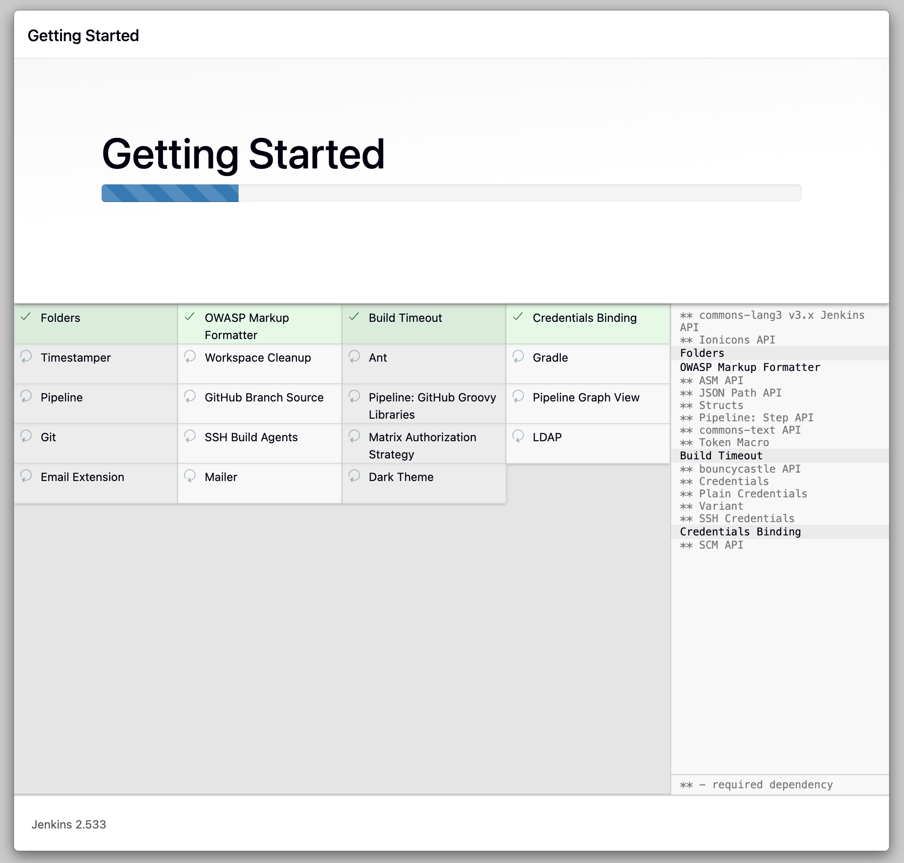

The plugin installation process will begin automatically. This may take several minutes depending on your internet connection.

---

## Creating Admin User

### Step 3: Create First Admin User

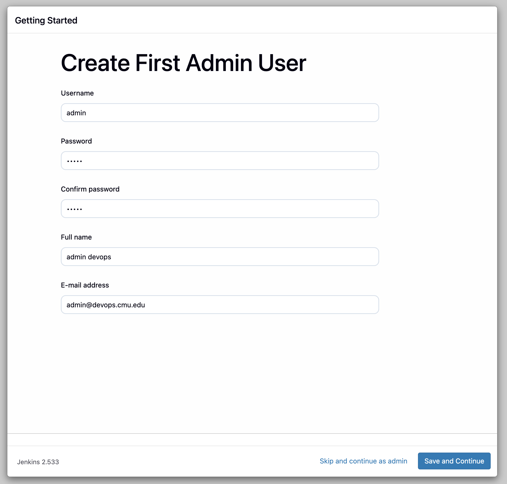

After plugins are installed, you'll need to create your first admin user:

1. **Fill in the required fields:**
   - **Username**: Choose a username (e.g., `admin`, `jenkins-admin`)
   - **Password**: Create a strong password
   - **Confirm password**: Re-enter the password
   - **Full name**: Your full name or organization name
   - **E-mail address**: Your email address

2. **Important Notes:**
   - Remember these credentials - you'll need them to log in
   - Choose a strong password for security
   - The email address can be used for notifications

3. Click "Save and Continue"

---

## Jenkins URL Configuration

### Step 4: Configure Jenkins URL

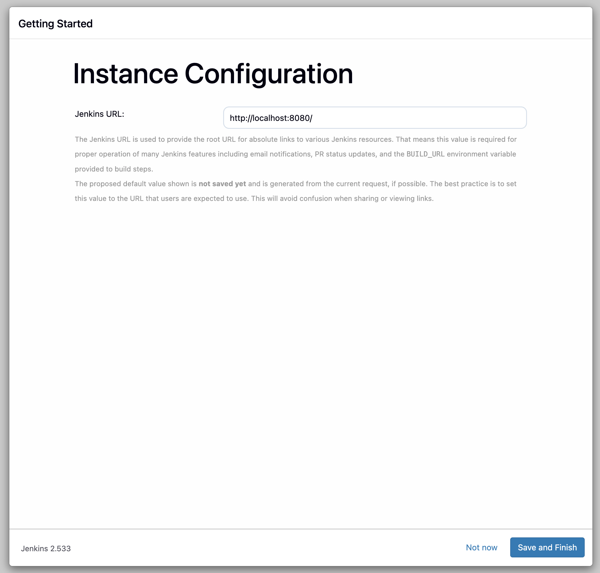

1. **Set the Jenkins URL:**
   - For local development: `http://localhost:8080/`
   - For production: Use your actual domain/IP address
   - For Docker environments: May need to use container networking

2. **Important Considerations:**
   - This URL is used for webhook callbacks
   - It should be accessible by external systems (like Git repositories)
   - You can change this later in Jenkins configuration

3. Click "Save and Finish"

---

## Setup Completion

### Step 5: Jenkins is Ready

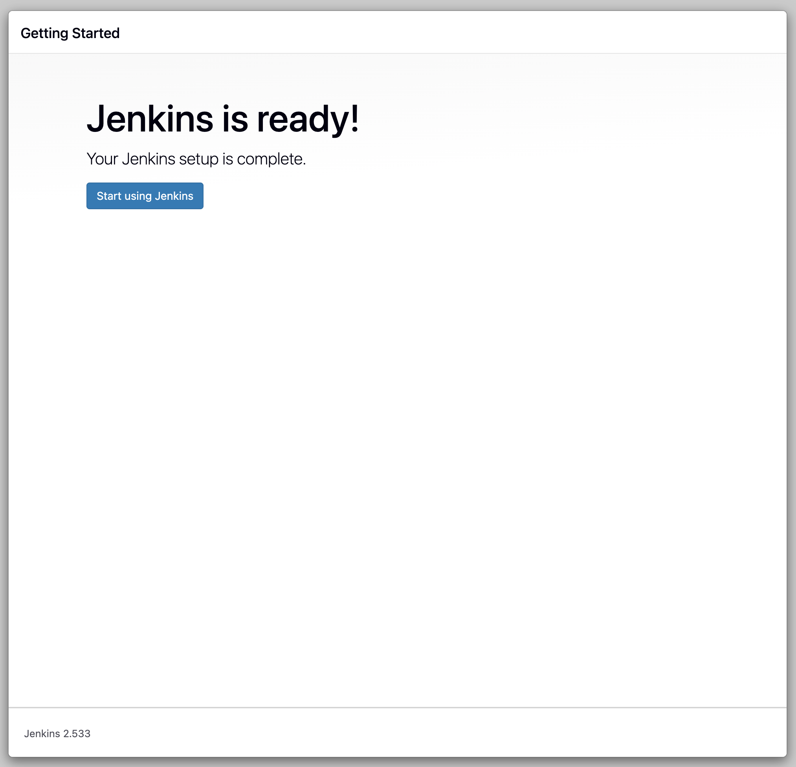

Congratulations! Jenkins setup is now complete.

1. Click "Start using Jenkins"


You'll now see the Jenkins dashboard with:

- Navigation menu on the left
- Main content area showing "Welcome to Jenkins!"
- Options to create new jobs and manage Jenkins

---

## Creating Your First Pipeline

### Step 6: Create a Simple Pipeline

Now let's create a simple "Hello World" pipeline to verify everything is working.

#### 6.1 Create New Pipeline Item

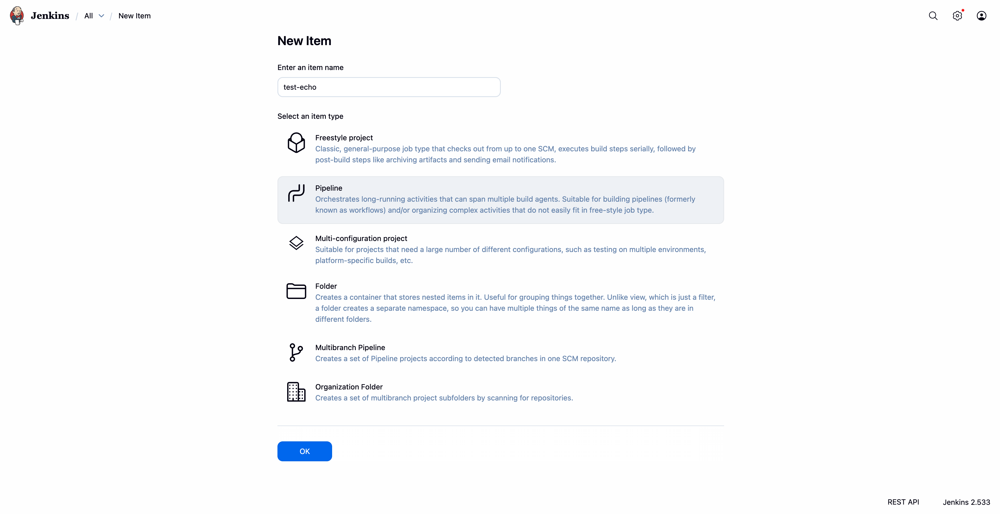

1. **Create New Item:**
   - Click "New Item" on the Jenkins dashboard
   - Enter a name for your pipeline (e.g., "hello-world-pipeline")
   - Select "Pipeline" as the project type
   - Click "OK"

#### 6.2 Configure Pipeline Script

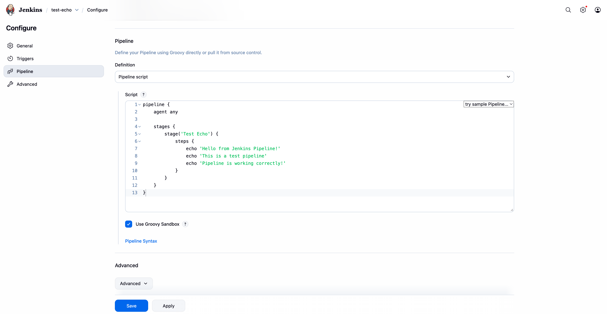

1. **Configure Pipeline:**
   - Scroll down to the "Pipeline" section
   - In the "Definition" dropdown, select "Pipeline script"
   - Enter the following simple pipeline script:

   ```groovy
   pipeline {
        agent any
        
        stages {
            stage('Test Echo') {
                steps {
                    echo 'Hello from Jenkins Pipeline!'
                    echo 'This is a test pipeline'
                    echo 'Pipeline is working correctly!'
                }
            }
        }
    }
   ```

2. **Save and Run:**
   - Click "Save"
   - Click "Build Now" to run your first pipeline

#### 6.3 View Pipeline Results

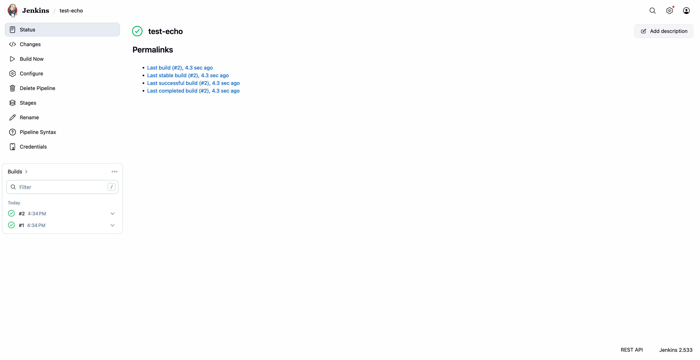

After running the pipeline, you'll see:

- The build appears in the "Build History" section
- A blue dot indicates a successful build
- You can click on the build number to see details

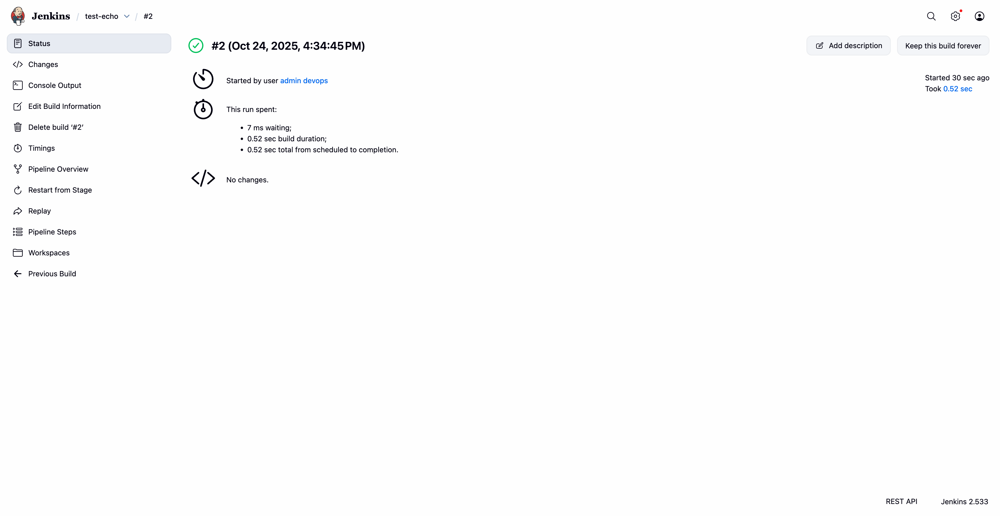

In the build details page, you can:

- See the overall build status
- View the duration of the build
- Access various build information and logs

#### 6.4 Check Console Output

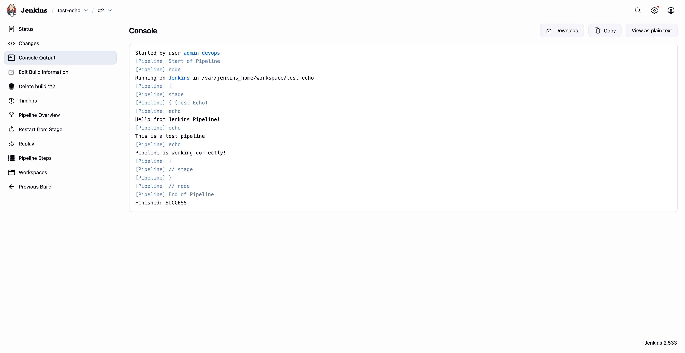

1. **Review Console Output:**
   - Click "Console Output" to see the detailed logs
   - Verify that your echo statements appear in the output
   - Confirm the pipeline executed successfully
   - The console shows each step of the pipeline execution

---

# Setting up the spring project build

## Step 1: Create a multi branch pipeline
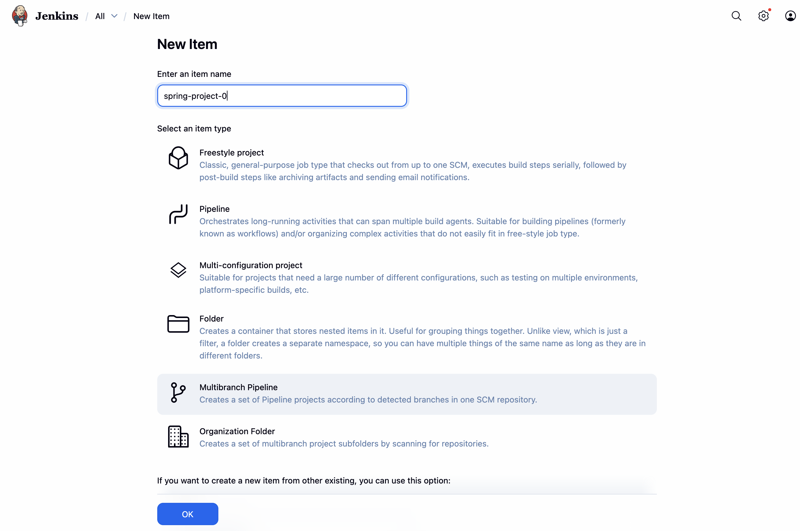

## Step 2: Configure the pipeline
- Paste the repository link
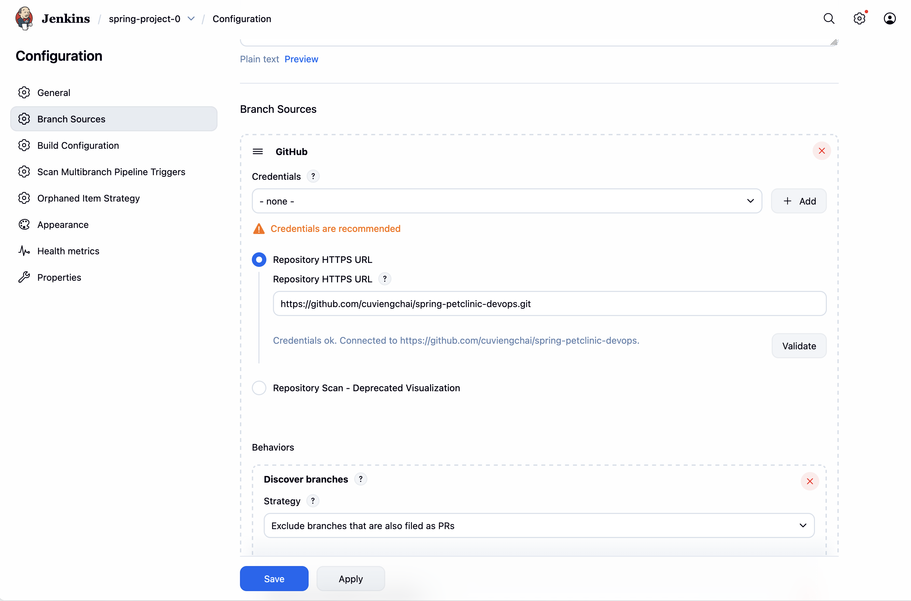

## Step 3: Jenkins Scan
- Jenkins will scan the repository and find the Jenkinsfile


## Step 4: Build the project
- Jenkins will automatically fetch the code and build the project based on the Jenkinsfile
- The building process is slow since jenkins automatically does rate limiting for Github access
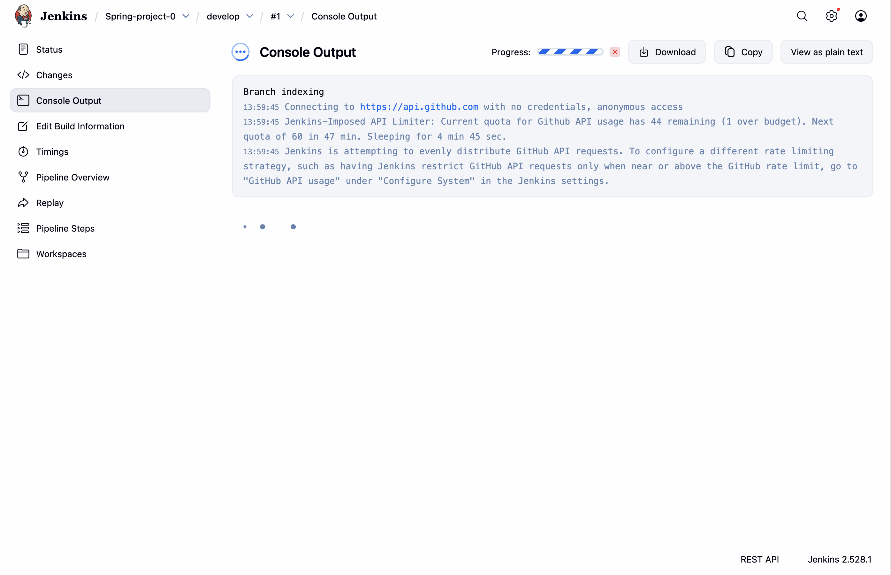
- Current jenkinsFile
```groovy
pipeline {
    agent any

    stages {
        stage('Setup Git') {
            steps {
                echo 'Configuring Git safe directory...'
                sh 'git config --global --add safe.directory "*"'
            }
        }

        stage('Checkout') {
            steps {
                echo 'Checking out Spring PetClinic source code...'
                git branch: 'develop', url: 'https://github.com/cuviengchai/spring-petclinic-devops.git'
            }
        }

        stage('View Project Structure') {
            steps {
                echo 'Displaying project structure...'
                sh 'ls -la'
                sh 'pwd'
            }
        }

        stage('Build Application') {
            steps {
                sh './gradlew clean build --no-daemon --no-build-cache -x checkstyleNohttp'
            }
        }
    }

    post {
        always {
            echo 'Pipeline completed'
        }
        success {
            echo 'Build completed successfully!'
        }
        failure {
            echo 'Build failed!'
        }
    }
}
```

## Step 4.1: Testing the jenkinsfile modification
- If we were to modify the Jenkinsfile, we can create a pipeline item and paste the modified Jenkinsfile there to test it out


## Additional Resources

- [Official Jenkins Documentation](https://www.jenkins.io/doc/)
- [Jenkins Pipeline Documentation](https://www.jenkins.io/doc/book/pipeline/)
- [Jenkins Plugin Index](https://plugins.jenkins.io/)
- [Jenkins Best Practices](https://www.jenkins.io/doc/book/using/best-practices/)
