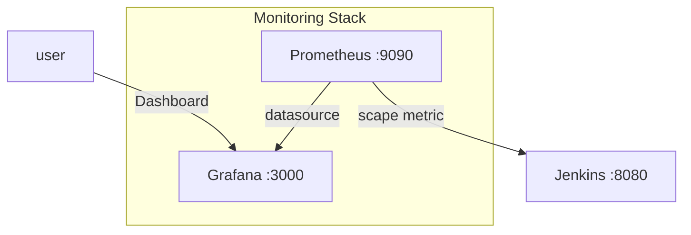
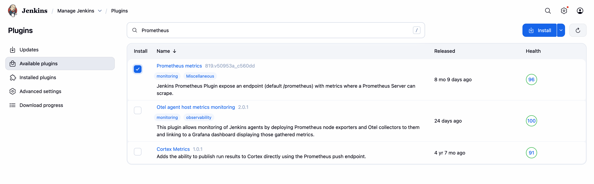
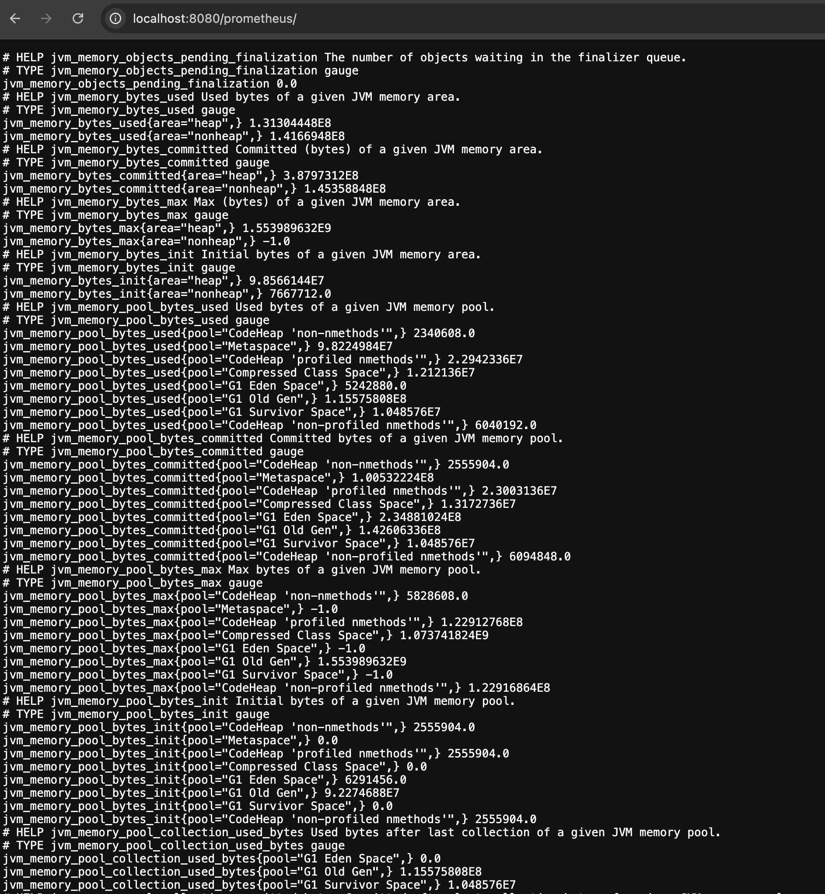
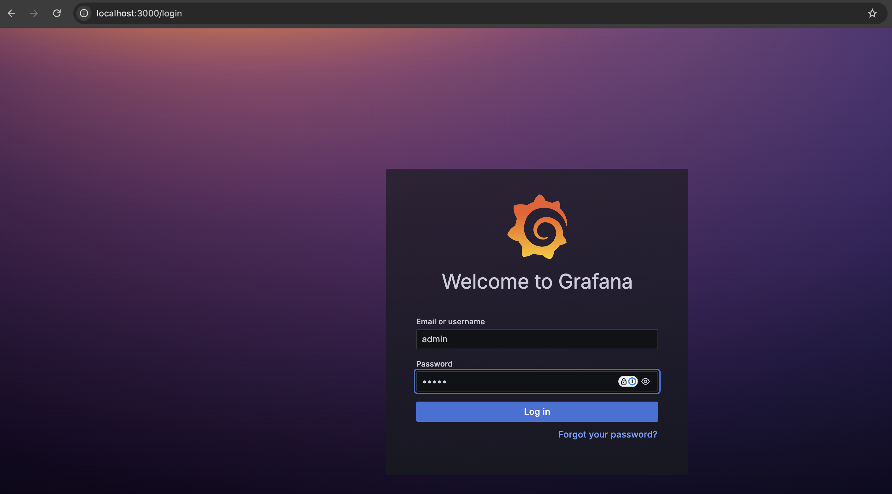
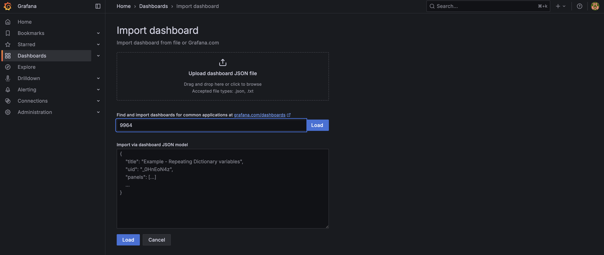
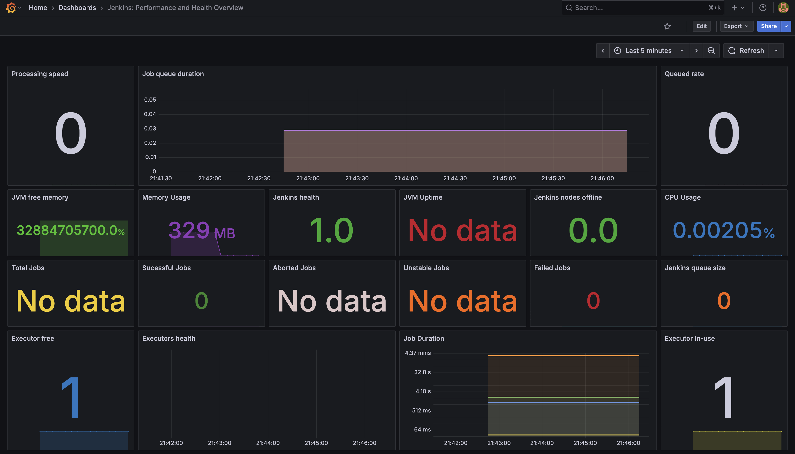

# Prometheus & Grafana Setup Guide

This guide provides step-by-step instructions for setting up Prometheus and Grafana for monitoring Jenkins and other applications, including configuration and dashboard creation.

## Prerequisites

- Docker and Docker Compose installed on your system
- Jenkins already running (see [Jenkins Setup Guide](setup_jenkins.md))

## Table of Contents

1. [Overview](#overview)
2. [Starting Prometheus & Grafana with Docker Compose](#starting-prometheus--grafana-with-docker-compose)
3. [Configure Jenkins for Prometheus Metrics](#configure-jenkins-for-prometheus-metrics)
4. [Verify Prometheus Targets](#verify-prometheus-targets)
5. [Access Grafana](#access-grafana)
6. [Configure Grafana Data Source](#configure-grafana-data-source)
7. [Import Jenkins Dashboard](#import-jenkins-dashboard)
8. [Verify Monitoring Setup](#verify-monitoring-setup)

---

## Overview



## Starting Prometheus & Grafana with Docker Compose

1. Navigate to the Grafana directory in your project:

   ```bash
   cd grafana/
   ```

2. Start Prometheus and Grafana using Docker Compose:

   ```bash
   docker compose up
   ```

   The Docker Compose configuration includes:

   ```yaml
   services:
     prometheus:
       image: prom/prometheus:latest
       container_name: prometheus
       ports:
         - "9090:9090"
       volumes:
         - ./prometheus.yml:/etc/prometheus/prometheus.yml
         - prometheus_data:/prometheus
       networks:
         - devops

     grafana:
       image: grafana/grafana:latest
       container_name: grafana
       ports:
         - "3000:3000"
       volumes:
         - grafana_data:/var/lib/grafana
         - ./grafana/provisioning:/etc/grafana/provisioning
       networks:
         - devops
   ```

3. Verify services are running:

   ```bash
   docker compose ps
   ```

4. Access the services:
   - **Prometheus**: `http://localhost:9090`
   - **Grafana**: `http://localhost:3000`

---

## Configure Jenkins for Prometheus Metrics

### Step 1: Install Prometheus Plugin in Jenkins



1. **Install the Prometheus Plugin:**
   - Go to Jenkins Dashboard → Manage Jenkins → Manage Plugins
   - Go to "Available" tab and search for "Prometheus"
   - Install the "Prometheus metrics plugin"
   - Restart Jenkins if required

### Step 2: Configure Prometheus Endpoint



1. **Enable Prometheus Metrics:**
   - Go to Manage Jenkins → Configure System
   - Scroll down to "Prometheus" section
   - Check "Enable Prometheus Endpoint"
   - Set the path (default: `/prometheus`)
   - Save the configuration

2. **Verify Metrics Endpoint:**
   - Access Jenkins metrics at: `http://localhost:8080/prometheus`
   - You should see Jenkins metrics in Prometheus format

---

## Verify Prometheus Targets

### Step 3: Check Prometheus Targets


1. **Access Prometheus UI:**
   - Open `http://localhost:9090` in your browser
   - Go to Status → Targets
   - Verify that Jenkins target is UP and healthy

### Step 4: Verify Jenkins Metrics in Prometheus


1. **Test Jenkins Metrics:**
   - In Prometheus, go to Graph tab
   - Try querying Jenkins metrics like:
     - `jenkins_builds_duration_milliseconds_summary`
     - `jenkins_executor_count_value`
     - `jenkins_job_count_value`
   - Verify that metrics are being collected successfully

---

## Access Grafana

### Step 5: Login to Grafana



1. **Access Grafana:**
   - Open `http://localhost:3000` in your browser
   - Use default credentials:
     - **Username**: `admin`
     - **Password**: `admin`
   - You'll be prompted to change the password on first login

---

## Configure Grafana Data Source

### Step 6: Add Prometheus Data Source


1. **Add Prometheus Data Source:**
   - Go to Configuration → Data Sources
   - Click "Add data source"
   - Select "Prometheus"
   - Configure the following:
     - **Name**: Prometheus
     - **URL**: `http://prometheus:9090` (for Docker networking)
     - **Access**: Server (default)
   - Click "Save & Test" to verify the connection

2. **Test the Connection:**
   - Go to Explore tab
   - Select Prometheus as data source
   - Try querying Jenkins metrics to verify data flow

---

## Import Jenkins Dashboard

### Step 7: Import Pre-built Dashboard



1. **Import Jenkins Dashboard:**
   - Go to Dashboards → Import
   - Use one of these methods:
     - **Grafana.com Dashboard ID**: `9964` (Jenkins Performance and Health Overview)
     - **Upload JSON file**: Import a custom dashboard file
     - **Paste JSON**: Copy and paste dashboard configuration

2. **Configure Dashboard:**
   - Select Prometheus as the data source
   - Adjust any panel settings as needed
   - Save the dashboard

### Step 8: View Jenkins Dashboard


After importing, you'll see the Jenkins dashboard with various panels showing:

- Jenkins system metrics
- Build statistics
- Executor usage
- Job performance metrics

---

## Verify Monitoring Setup

### Step 9: Dashboard with Live Data



1. **Verify Live Data:**
   - Check that all dashboard panels are showing data
   - Run some Jenkins builds to generate metrics
   - Observe real-time updates in Grafana dashboards

2. **Key Metrics to Monitor:**
   - **Build Duration**: Time taken for builds
   - **Build Success Rate**: Percentage of successful builds
   - **Executor Usage**: Jenkins executor utilization
   - **Queue Length**: Number of jobs waiting in queue
   - **System Resources**: CPU, memory usage of Jenkins

3. **Set Up Alerts (Optional):**
   - Configure alert rules for critical metrics
   - Set up notification channels (email, Slack, etc.)
   - Test alert notifications

---

## Additional Resources

- [Prometheus Documentation](https://prometheus.io/docs/)
- [Grafana Documentation](https://grafana.com/docs/)
- [Jenkins Prometheus Plugin](https://plugins.jenkins.io/prometheus/)
- [Grafana Dashboard Library](https://grafana.com/grafana/dashboards/)
- [Prometheus Best Practices](https://prometheus.io/docs/practices/)
