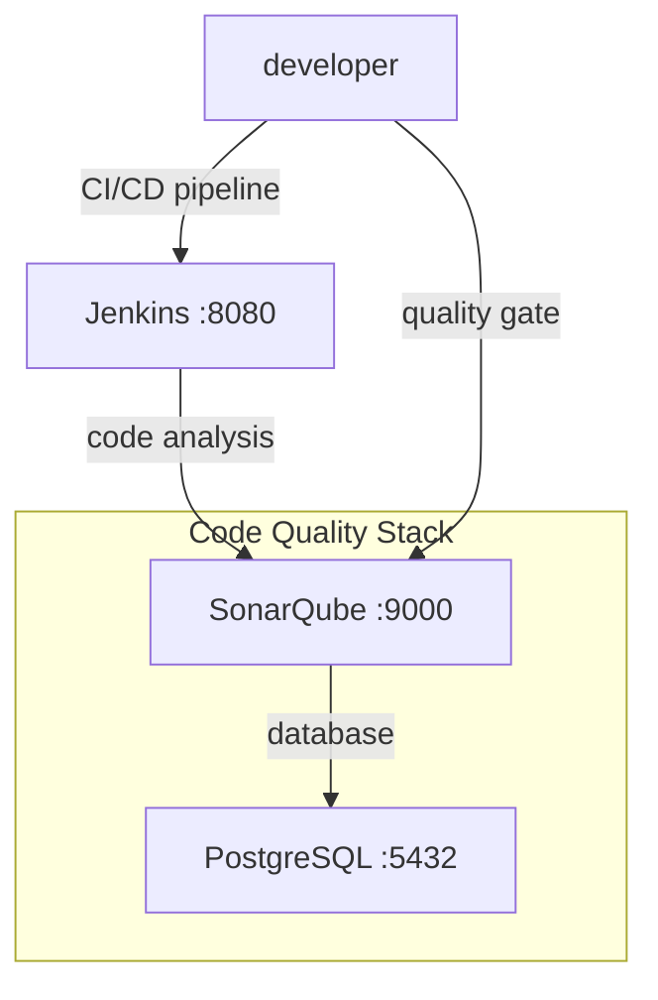
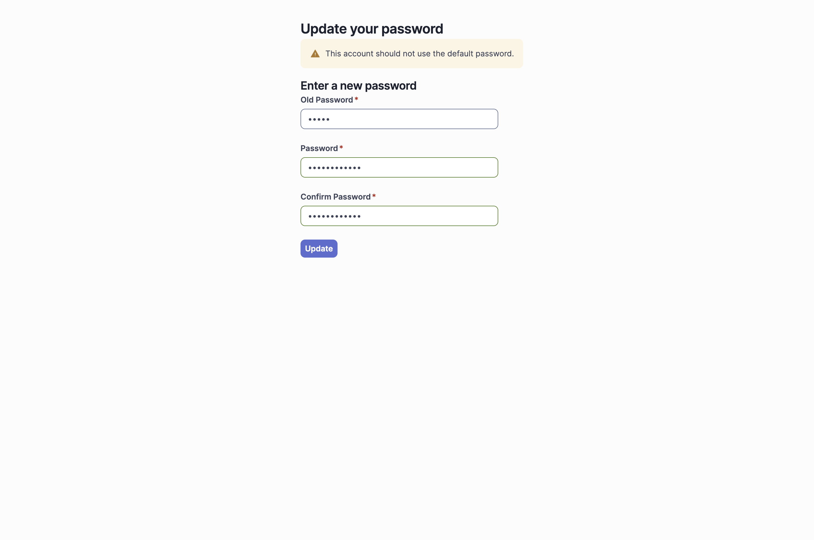
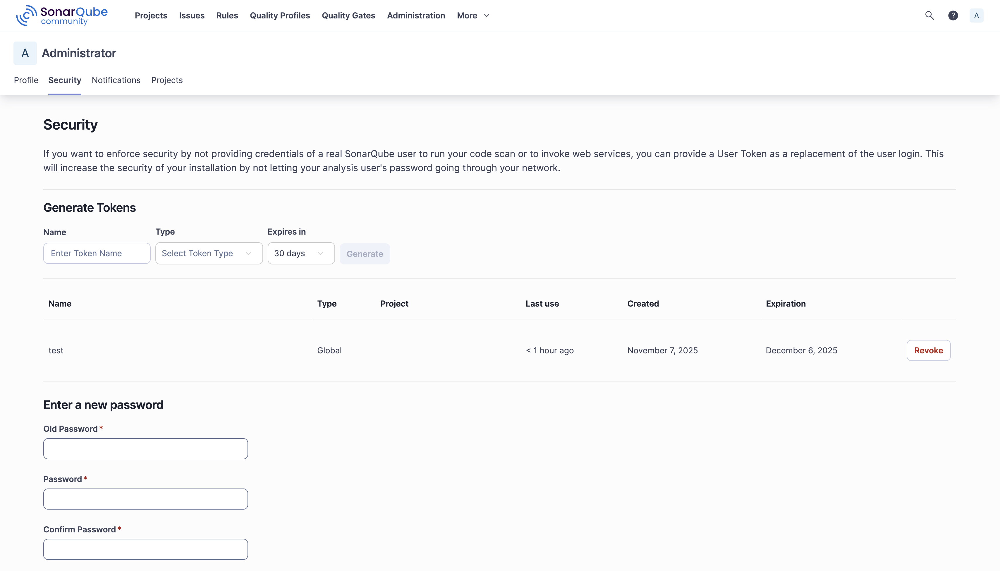
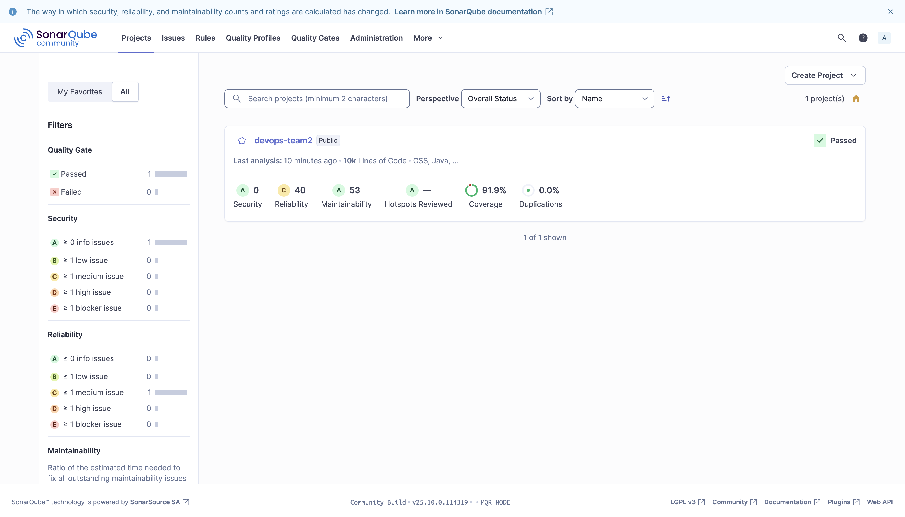
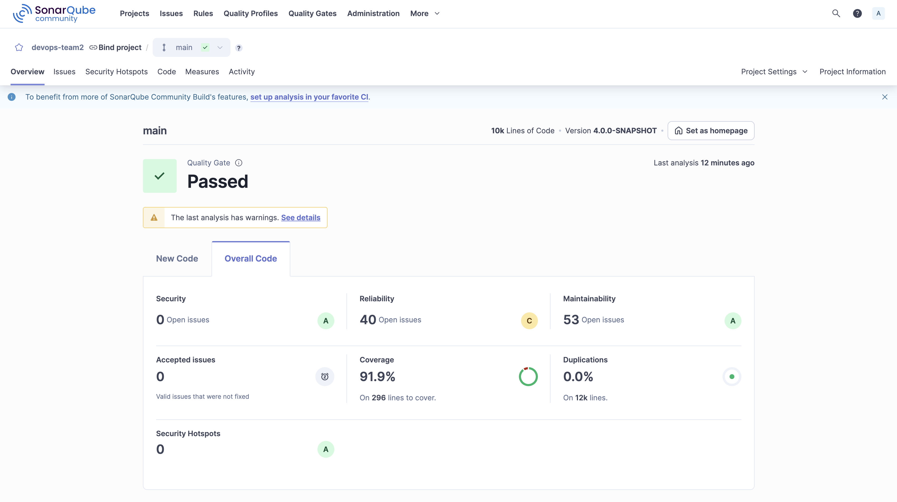
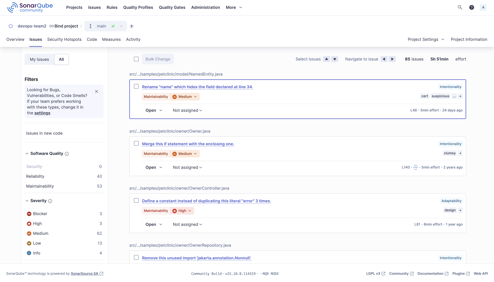
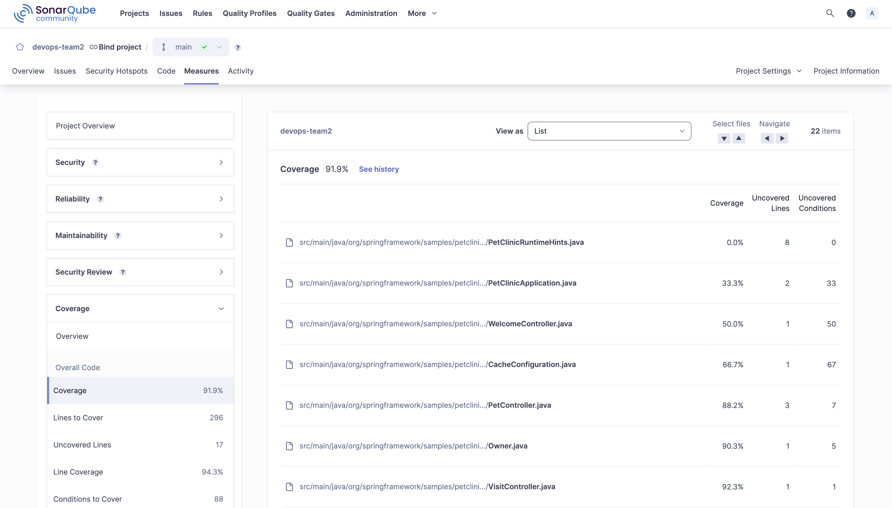

# SonarQube Setup Guide

This guide provides step-by-step instructions for setting up SonarQube for static code analysis and quality gate management, including configuration and integration with Jenkins CI/CD pipeline.

## Prerequisites

- Docker and Docker Compose installed on your system
- Java 21 and Gradle (for local builds)
- Jenkins already running (see [Jenkins Setup Guide](setup_jenkins.md))

## Table of Contents

1. [Overview](#overview)
2. [Starting SonarQube with Docker Compose](#starting-sonarqube-with-docker-compose)
3. [Access SonarQube](#access-sonarqube)
4. [Initial Setup and Configuration](#initial-setup-and-configuration)
5. [Generate Authentication Token](#generate-authentication-token)
6. [Configure Project for Analysis](#configure-project-for-analysis)
7. [Run Code Analysis](#run-code-analysis)
8. [View Analysis Results](#view-analysis-results)
9. [Jenkins Integration](#jenkins-integration)

---

## Overview



## Starting SonarQube with Docker Compose

1. Navigate to the SonarQube directory in your project:

   ```bash
   cd script/sonarqube/
   ```

2. Start SonarQube and PostgreSQL using Docker Compose:

   ```bash
   docker compose up -d
   ```

   The Docker Compose configuration includes:

   ```yaml
   services:
     sonarqube:
       image: sonarqube:community
       container_name: sonarqube
       restart: unless-stopped
       ports:
         - "9000:9000"
       environment:
         - SONAR_JDBC_URL=jdbc:postgresql://sonarqube-db:5432/sonar
         - SONAR_JDBC_USERNAME=sonar
         - SONAR_JDBC_PASSWORD=sonar
       volumes:
         - ./docker/sonar/sonarqube_data:/opt/sonarqube/data
         - ./docker/sonar/sonarqube_logs:/opt/sonarqube/logs
         - ./docker/sonar/sonarqube_extensions:/opt/sonarqube/extensions
       depends_on:
         sonarqube-db:
           condition: service_healthy
       networks:
         - sonarqube-net

     sonarqube-db:
       image: postgres:17
       container_name: sonarqube-db
       restart: unless-stopped
       environment:
         - POSTGRES_USER=sonar
         - POSTGRES_PASSWORD=sonar
         - POSTGRES_DB=sonar
       volumes:
         - postgresql_data:/var/lib/postgresql/data
       healthcheck:
         test: ["CMD-SHELL", "pg_isready -U sonar"]
         interval: 10s
         timeout: 5s
         retries: 5
         start_period: 30s
       networks:
         - sonarqube-net
   ```

3. Verify services are running:

   ```bash
   docker compose ps
   ```

4. Wait for SonarQube to start completely (this may take a few minutes):

   ```bash
   docker compose logs -f sonarqube
   ```

5. Access SonarQube:
   - **SonarQube Web UI**: `http://localhost:9000`

---

## Access SonarQube

### Step 1: Login to SonarQube


1. **Access SonarQube:**
   - Open `http://localhost:9000` in your browser
   - Use default credentials:
     - **Username**: `admin`
     - **Password**: `admin`

---

## Initial Setup and Configuration

### Step 2: Automated Setup (Recommended)

For a quick automated setup, use the provided setup script:

1. **Navigate to Jenkins directory:**

   ```bash
   cd jenkins/
   ```

2. **Run the automated setup script:**

   ```bash
   ./setup-sonarqube.sh
   ```

   This script will:
   - Wait for SonarQube to be ready
   - Use default credentials (`admin`/`qazxswedcR@1`)
   - Automatically generate a Jenkins token
   - Provide configuration instructions

### Step 2 (Alternative): Manual Setup



1. **Change Default Password:**
   - On first login, you'll be prompted to change the default password
   - Default credentials: `admin`/`admin`
   - Enter a new secure password (e.g., `qazxswedcR@1`)
   - Confirm the password change
   - Login with the new credentials

---

## Generate Authentication Token

### Step 3: Create Authentication Token



**If using automated setup, skip this step** - the script creates the token automatically.

1. **Generate User Token (Manual method):**
   - Go to User Account → Security
   - In the "Tokens" section, enter a token name (e.g., `jenkins-integration`)
   - Click "Generate"
   - **Important**: Copy and save the token immediately (it won't be shown again)
   - This token will be used for Jenkins integration and command-line analysis

---

## Configure Project for Analysis

### Step 4: Create New Project



1. **Create Project:**
   - Click "Create Project" → "Manually"
   - Enter project details:
     - **Project display name**: `Spring PetClinic DevOps`
     - **Project key**: `devops-team2` (must match build.gradle configuration)
     - **Main branch name**: `develop`
   - Click "Set Up"

2. **Choose Analysis Method:**
   - Select "Use existing token" or create a new one
   - Choose analysis method: "Other" → "Gradle"
   - Follow the provided instructions

---

## Run Code Analysis

### Step 5: Execute SonarQube Analysis

1. **Navigate to project root:**

   ```bash
   cd /path/to/spring-petclinic-devops
   ```

2. **Run analysis with Gradle:**

   ```bash
   ./gradlew clean build jacocoTestReport sonar \
     -Dsonar.host.url=http://localhost:9000 \
     -Dsonar.login=YOUR_TOKEN_HERE
   ```

   Or use the shorthand command as configured in `build.gradle`:

   ```bash
   ./gradlew build jacocoTestReport -Dsonar.host.url=http://localhost:9000 sonar
   ```

3. **Gradle SonarQube Configuration:**
   
   The project is already configured with the SonarQube plugin in `build.gradle`:

   ```groovy
   plugins {
     id "org.sonarqube" version "7.0.1.6134"
     id "jacoco"
   }

   sonar {
     properties {
       property('sonar.projectName', 'devops-team2')
       property("sonar.projectKey", "devops-team2")
       property("sonar.sources", "src/main")
       property "sonar.tests", "src/test"
     }
   }

   jacocoTestReport {
     reports {
       xml.required = true
       html.outputLocation = layout.buildDirectory.dir('jacocoHtml')
     }
   }
   ```

---

## View Analysis Results

### Step 6: Project Overview



After successful analysis, you can view:

1. **Quality Gate Status**: Pass/Fail status based on defined criteria
2. **Code Coverage**: Percentage of code covered by tests
3. **Duplications**: Percentage of duplicated code blocks
4. **Issues**: Number of bugs, vulnerabilities, and code smells
5. **Security Rating**: Security assessment of the codebase
6. **Maintainability Rating**: Code maintainability assessment

### Step 7: Issue Analysis



1. **Review Issues:**
   - Navigate to "Issues" tab
   - Filter by severity, type, and status
   - Review code smells, bugs, and vulnerabilities
   - Assign issues to team members
   - Add comments and track resolution progress

### Step 8: Test Coverage Report



1. **Analyze Coverage:**
   - Go to "Coverage" tab
   - Review line and branch coverage metrics
   - Identify uncovered code areas
   - Set coverage targets and quality gates

---

## Jenkins Integration

### Step 9: Configure Jenkins SonarQube Plugin

1. **Install SonarQube Scanner Plugin:**
   - Go to Jenkins → Manage Jenkins → Manage Plugins
   - Install "SonarQube Scanner" plugin
   - Restart Jenkins if required

2. **Configure SonarQube Server:**
   - Go to Manage Jenkins → Configure System
   - Find "SonarQube servers" section
   - Add SonarQube server:
     - **Name**: `SonarQube`
     - **Server URL**: `http://sonarqube:9000` (for Docker network)
     - **Server authentication token**: Select the credential created earlier

3. **Configure Scanner Tool:**
   - Go to Manage Jenkins → Global Tool Configuration
   - Find "SonarQube Scanner" section
   - Add SonarQube Scanner installation
   - Choose "Install automatically" or specify installation directory

4. **Add Jenkins Credential for SonarQube Token:**
   - Go to Manage Jenkins → Credentials
   - Add new "Secret Text" credential:
     - **Secret**: The token from setup script (e.g., `squ_8c3dedd2826e7e23b988bdeeb75d9e543155a53e`)
     - **ID**: `sonar-token`
     - **Description**: `SonarQube Authentication Token`

5. **Configure Webhook (Optional):**
   Run the webhook setup script for quality gate integration:

   ```bash
   cd jenkins/
   ./setup-sonarqube-webhook.sh
   ```

   This creates a webhook that notifies Jenkins when SonarQube analysis completes.

---

## Jenkinsfile Integration

The project includes SonarQube integration in the Jenkins pipeline:

```groovy
stage('SonarQube Analysis') {
    steps {
        withSonarQubeEnv('SonarQube') {
            sh './gradlew sonar -Dsonar.projectKey=devops-team2 -Dsonar.projectName=devops-team2 -Dsonar.host.url=http://sonarqube:9000 -Dsonar.token=******'
        }
    }
}

stage('Quality Gate') {
    steps {
        timeout(time: 5, unit: 'MINUTES') {
            waitForQualityGate abortPipeline: true
        }
    }
}
```

## Troubleshooting

### Common Issues

1. **SonarQube not accessible:**
   - Verify Docker containers are running: `docker compose ps`
   - Check logs: `docker compose logs sonarqube`

2. **Quality Gate timeout:**
   - Increase timeout in Jenkinsfile
   - Check webhook configuration: `http://localhost:9000/admin/webhooks`

3. **Token authentication fails:**
   - Regenerate token and update Jenkins credentials
   - Ensure correct token format and permissions

4. **Analysis fails:**
   - Check build.gradle SonarQube configuration
   - Verify Java 21 compatibility
   - Run locally: `./gradlew build jacocoTestReport -Dsonar.host.url=http://localhost:9000 sonar`

---

## Additional Resources

- [SonarQube Documentation](https://docs.sonarqube.org/)
- [SonarQube Gradle Plugin](https://docs.sonarqube.org/latest/analyzing-source-code/scanners/sonarscanner-for-gradle/)
- [Jenkins SonarQube Plugin](https://plugins.jenkins.io/sonar/)
- [Quality Gates Guide](https://docs.sonarqube.org/latest/user-guide/quality-gates/)
- [SonarQube Rules](https://rules.sonarsource.com/)
- [Docker Network Configuration](https://docs.docker.com/compose/networking/)
