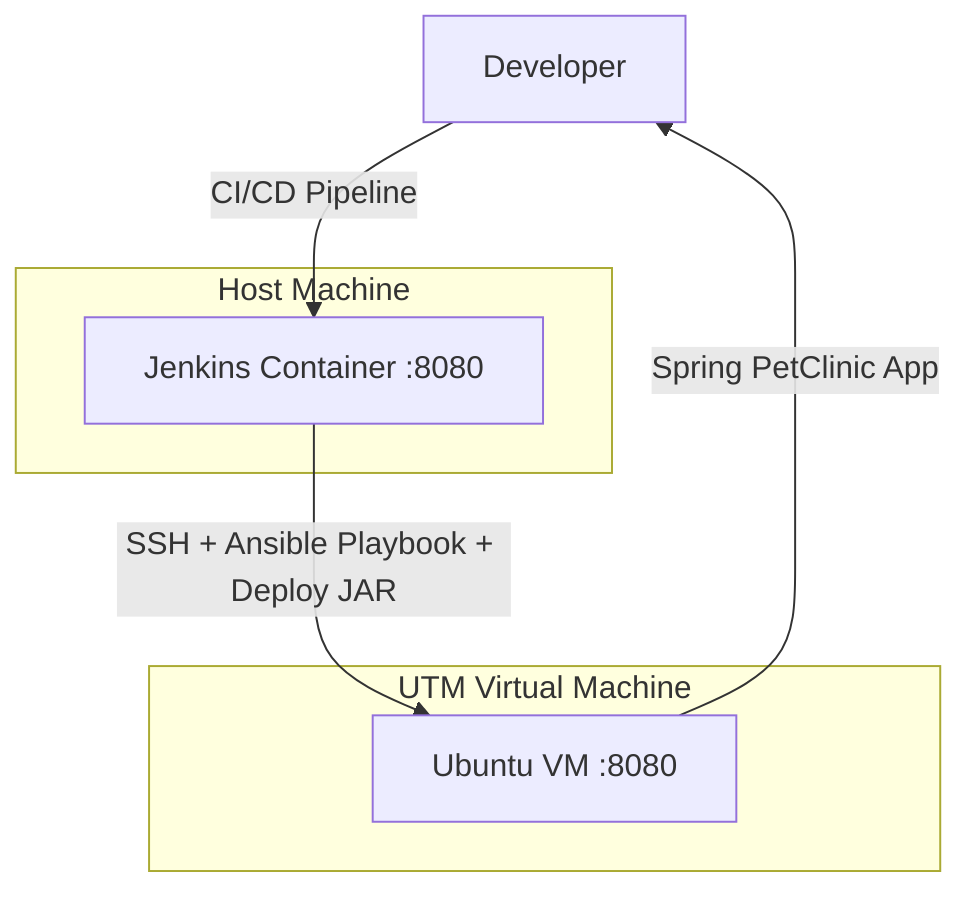
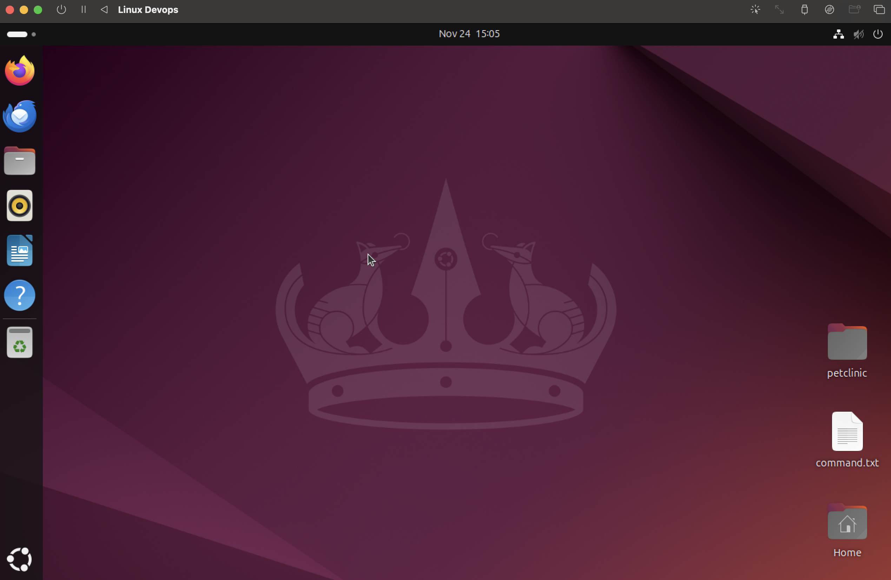
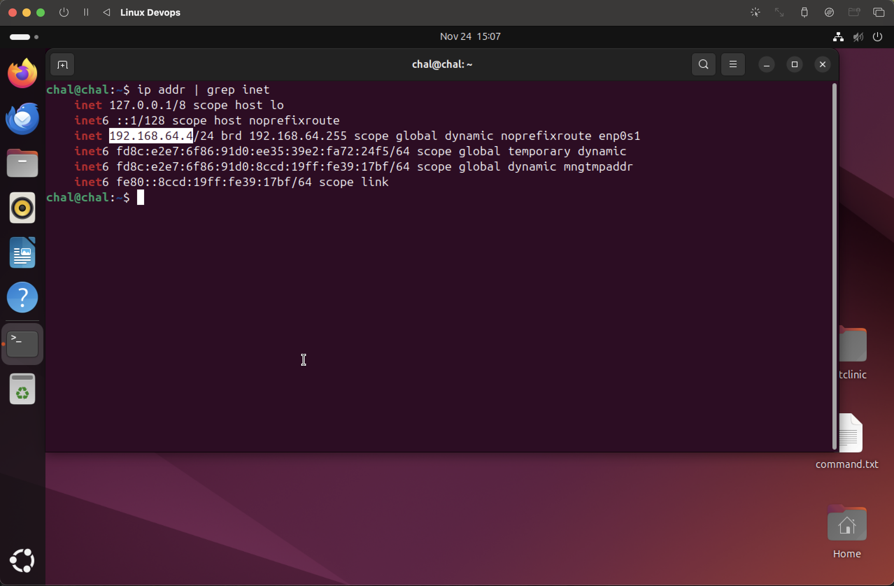
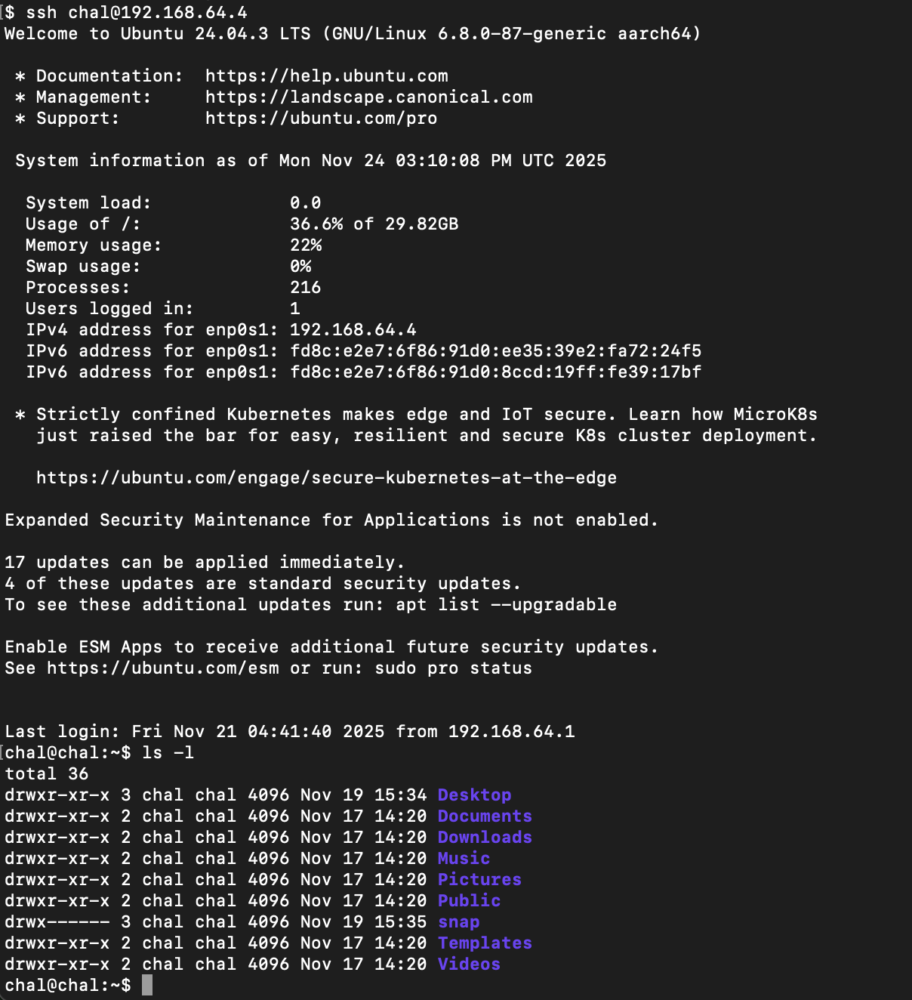
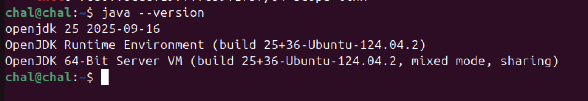
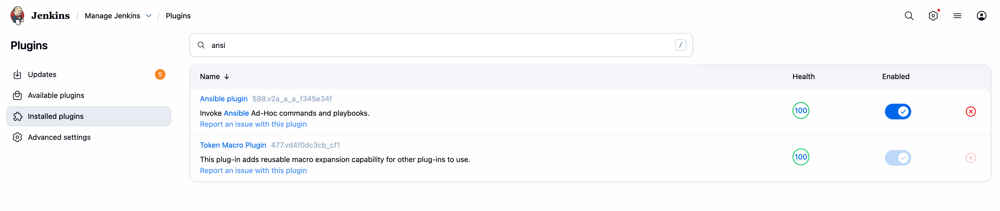
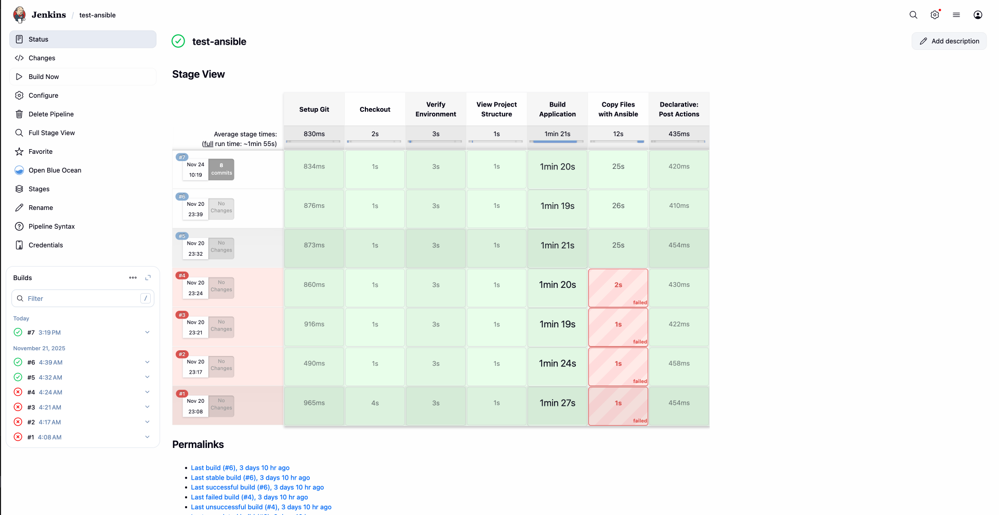
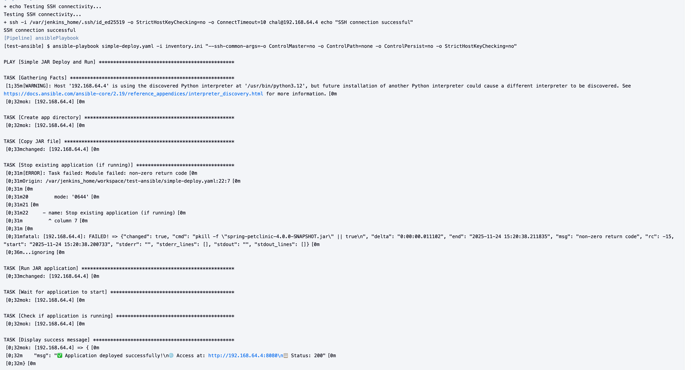
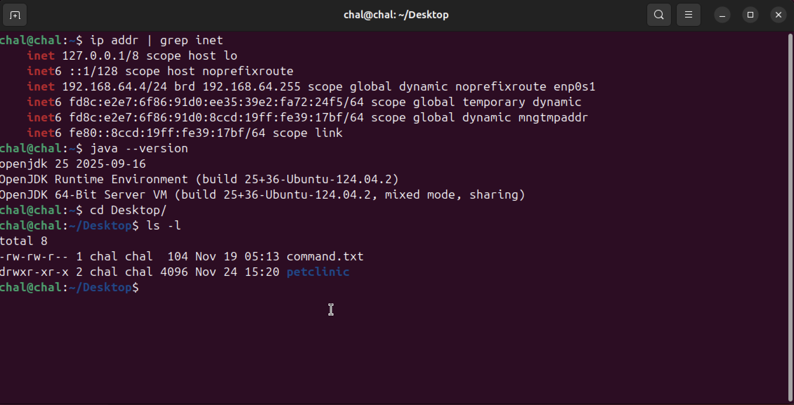
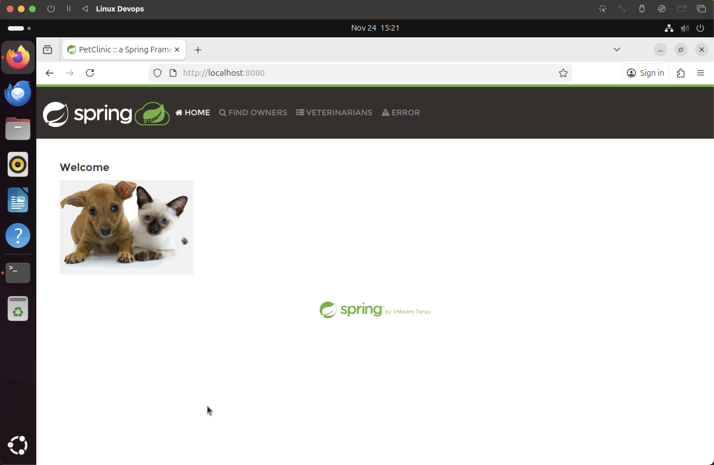

# Ansible VM Setup Guide

This guide provides step-by-step instructions for setting up Ansible automation with Ubuntu VM for deploying the Spring PetClinic application, including VM configuration, SSH key setup, and Jenkins integration.

## Prerequisites

- UTM Hypervisor installed on macOS
- Ubuntu 24.04 LTS ISO image
- Docker and Docker Compose installed on your system
- Jenkins already running (see [Jenkins Setup Guide](setup_jenkins.md))

## Table of Contents

1. [Overview](#overview)
2. [VM Setup with UTM](#vm-setup-with-utm)
3. [Network Configuration](#network-configuration)
4. [SSH Key Setup](#ssh-key-setup)
5. [Java Installation on VM](#java-installation-on-vm)
6. [Jenkins Ansible Plugin Setup](#jenkins-ansible-plugin-setup)
7. [Ansible Configuration](#ansible-configuration)
8. [Jenkins Pipeline Integration](#jenkins-pipeline-integration)
9. [Deployment Testing](#deployment-testing)
10. [Verify Application Deployment](#verify-application-deployment)

---

## Overview



## VM Setup with UTM

### Step 1: Create Ubuntu VM



1. **Create New VM in UTM:**
   - Open UTM and click "Create a New Virtual Machine"
   - Select "Virtualize" for better performance
   - Choose "Linux" as the operating system
   - Select Ubuntu 24.04 LTS ISO image

2. **Installation Process:**
   - Boot from Ubuntu 24.04 ISO
   - Follow the Ubuntu installation wizard
   - Create user account (e.g., username: `chal`)
   - Complete the installation and reboot

---

## Network Configuration

### Step 2: Configure Network Settings



1. **Set Network Mode in UTM:**
   - In UTM VM settings, go to Network
   - Set Network Mode to "Shared Network"
   - This allows the VM to get an IP address and communicate with the host

2. **Note the IP Address:**
   - Record the VM's IP address (e.g., `192.168.64.4`)
   - This will be used in the Ansible inventory configuration

---

## SSH Key Setup

### Step 3: Generate SSH Keys and Configure Access



1. **Generate SSH Key in Jenkins Container:**

   ```bash
   # Access Jenkins container
   docker exec -it jenkins bash
   
   # Generate SSH key pair
   ssh-keygen -t ed25519 -f /var/jenkins_home/.ssh/id_ed25519 -N ""
   
   # Display public key
   cat /var/jenkins_home/.ssh/id_ed25519.pub
   ```

2. **Copy Public Key to Ubuntu VM:**

   ```bash
   # On Ubuntu VM, create .ssh directory if it doesn't exist
   mkdir -p ~/.ssh
   chmod 700 ~/.ssh
   
   # Add Jenkins public key to authorized_keys
   echo "ssh-ed25519 AAAAC3NzaC1lZDI1NTE5AAAAIExamplePublicKey jenkins@container" >> ~/.ssh/authorized_keys
   chmod 600 ~/.ssh/authorized_keys
   ```

3. **Test SSH Connection from Jenkins:**

   ```bash
   # From Jenkins container, test SSH connection
   ssh -i /var/jenkins_home/.ssh/id_ed25519 chal@192.168.64.4
   ```

4. **Configure SSH for Password-less Login:**

   ```bash
   # On Ubuntu VM, ensure SSH service is running
   sudo systemctl status ssh
   sudo systemctl enable ssh
   sudo systemctl start ssh
   ```

---

## Java Installation on VM

### Step 4: Install Java on Ubuntu VM



1. **Update Package Repository:**

   ```bash
   sudo apt update
   sudo apt upgrade -y
   ```

2. **Install Java 21 (OpenJDK):**

   ```bash
   sudo apt install openjdk-21-jdk -y
   ```

3. **Verify Java Installation:**

   ```bash
   java -version
   javac -version
   ```

4. **Set JAVA_HOME (Optional):**

   ```bash
   echo 'export JAVA_HOME=/usr/lib/jvm/java-21-openjdk-amd64' >> ~/.bashrc
   echo 'export PATH=$JAVA_HOME/bin:$PATH' >> ~/.bashrc
   source ~/.bashrc
   ```

5. **Check Java Installation:**

   ```bash
   which java
   echo $JAVA_HOME
   ```

---

## Jenkins Ansible Plugin Setup

### Step 5: Install and Configure Ansible Plugin



1. **Install Ansible Plugin:**
   - Go to Jenkins Dashboard → Manage Jenkins → Manage Plugins
   - Go to "Available" tab and search for "Ansible"
   - Install the "Ansible" plugin
   - Restart Jenkins if required

2. **Configure Ansible Installation:**
   - Go to Manage Jenkins → Global Tool Configuration
   - Find "Ansible" section
   - Add Ansible installation:
     - **Name**: `Ansible`
     - **Path to ansible executables directory**: `/usr/bin/` (or auto-install)
     - Check "Install automatically" if Ansible is not installed

---

## Ansible Configuration

### Step 6: Create Ansible Playbook and Inventory

1. **Create Inventory File (`inventory.ini`):**

   ```ini
   [myhosts]
   192.168.64.4 ansible_user=chal ansible_ssh_private_key_file=/var/jenkins_home/.ssh/id_ed25519
   ```

2. **Create Ansible Playbook (`simple-deploy.yaml`):**

   ```yaml
   ---
   - name: Simple JAR Deploy and Run
     hosts: myhosts
     vars:
       jar_file: "spring-petclinic-4.0.0-SNAPSHOT.jar"
       app_port: 8080
       app_dir: "/home/chal/Desktop/petclinic"

     tasks:
       - name: Create app directory
         file:
           path: "{{ app_dir }}"
           state: directory
           mode: '0755'

       - name: Copy JAR file
         copy:
           src: "build/libs/{{ jar_file }}"
           dest: "{{ app_dir }}/{{ jar_file }}"
           mode: '0644'

       - name: Stop existing application (if running)
         shell: |
           pkill -f "{{ jar_file }}" || true
         ignore_errors: yes

       - name: Run JAR application
         shell: |
           cd {{ app_dir }}
           nohup java -jar {{ jar_file }} --server.port={{ app_port }} > app.log 2>&1 &
         async: 10
         poll: 0

       - name: Wait for application to start
         wait_for:
           port: "{{ app_port }}"
           delay: 15
           timeout: 60

       - name: Check if application is running
         uri:
           url: "http://{{ ansible_default_ipv4.address }}:{{ app_port }}"
           method: GET
           status_code: 200
         register: app_status
         retries: 3
         delay: 5

       - name: Display success message
         debug:
           msg: |
             ✅ Application deployed successfully!
             🌐 Access at: http://{{ ansible_default_ipv4.address }}:{{ app_port }}
             📋 Status: {{ app_status.status }}
   ```

3. **Test Ansible Configuration:**

   ```bash
   # From Jenkins container or local machine with Ansible
   ansible -i inventory.ini myhosts -m ping
   ```

---

## Jenkins Pipeline Integration

### Step 7: Configure Jenkins Pipeline with Ansible



1. **Update Jenkinsfile to Include Ansible Deployment:**

   Add the following stage to your Jenkins pipeline:

   ```groovy
   pipeline {
       agent any

       stages {
           stage('Setup Git') {
               steps {
                   echo 'Configuring Git safe directory...'
                   sh 'git config --global --add safe.directory "*"'
               }
           }

           stage('Checkout') {
               steps {
                   echo 'Checking out Spring PetClinic source code...'
                   git branch: 'feat/ansible', url: 'https://github.com/cuviengchai/spring-petclinic-devops.git'
               }
           }

           stage('Build Application') {
               steps {
                   sh './gradlew clean build --no-daemon --no-build-cache -x checkstyleNohttp'
               }
           }

           stage('Deploy with Ansible') {
               steps {
                   echo 'Deploying application using Ansible...'
                   ansiblePlaybook(
                       playbook: 'simple-deploy.yaml',
                       inventory: 'inventory.ini',
                       disableHostKeyChecking: true,
                       colorized: true
                   )
               }
           }
       }

       post {
           always {
               echo 'Pipeline completed'
           }
           success {
               echo 'Build and deployment completed successfully!'
           }
           failure {
               echo 'Build or deployment failed!'
           }
       }
   }
   ```

2. **Pipeline Configuration Options:**
   - **playbook**: Path to Ansible playbook file
   - **inventory**: Path to inventory file
   - **disableHostKeyChecking**: Skip SSH host key verification
   - **colorized**: Enable colored output in Jenkins logs

---

## Deployment Testing

### Step 8: Run Jenkins Pipeline



1. **Execute Pipeline:**
   - Go to your Jenkins job
   - Click "Build Now"
   - Monitor the pipeline execution

2. **Monitor Ansible Stage:**
   - Watch the "Deploy with Ansible" stage
   - Review the console output for:
     - SSH connection establishment
     - File copying progress
     - Application startup logs
     - Health check results

3. **Check Console Output:**

   ```text
   PLAY [Simple JAR Deploy and Run] ***********************************************

   TASK [Gathering Facts] *********************************************************
   ok: [192.168.64.4]

   TASK [Create app directory] ****************************************************
   changed: [192.168.64.4]

   TASK [Copy JAR file] ***********************************************************
   changed: [192.168.64.4]

   TASK [Stop existing application (if running)] *********************************
   changed: [192.168.64.4]

   TASK [Run JAR application] *****************************************************
   changed: [192.168.64.4]

   TASK [Wait for application to start] ******************************************
   ok: [192.168.64.4]

   TASK [Check if application is running] ****************************************
   ok: [192.168.64.4]

   TASK [Display success message] ************************************************
   ok: [192.168.64.4] => {
       "msg": "✅ Application deployed successfully!\n🌐 Access at: http://192.168.64.4:8080\n📋 Status: 200"
   }

   PLAY RECAP *********************************************************************
   192.168.64.4               : ok=8    changed=4    unreachable=0    failed=0    skipped=0    rescued=0    ignored=0
   ```

---

## Verify Application Deployment

### Step 9: Check JAR File Deployment



1. **Verify Files on Ubuntu VM:**

   ```bash
   # Check if directory was created
   ls -la /home/chal/Desktop/petclinic/

   # Check JAR file
   ls -la /home/chal/Desktop/petclinic/spring-petclinic-4.0.0-SNAPSHOT.jar

   # Check application logs
   tail -f /home/chal/Desktop/petclinic/app.log
   ```

2. **Verify Application Process:**

   ```bash
   # Check if Java application is running
   ps aux | grep spring-petclinic

   # Check listening ports
   netstat -tlnp | grep 8080
   ```

### Step 10: Access Deployed Application



1. **Access Application via Browser:**
   - Open web browser on host machine
   - Navigate to: `http://192.168.64.4:8080`
   - Verify Spring PetClinic application loads correctly

2. **Application Health Check:**

   ```bash
   # From host machine or VM
   curl http://192.168.64.4:8080
   curl http://192.168.64.4:8080/actuator/health
   ```

---

## Additional Resources

- [Ansible Documentation](https://docs.ansible.com/)
- [Jenkins Ansible Plugin](https://plugins.jenkins.io/ansible/)
- [Ubuntu Server Guide](https://ubuntu.com/server/docs)
- [UTM Documentation](https://mac.getutm.app/support/)
- [SSH Best Practices](https://www.ssh.com/academy/ssh/best-practices)
- [Spring Boot Deployment Guide](https://docs.spring.io/spring-boot/docs/current/reference/html/deployment.html)